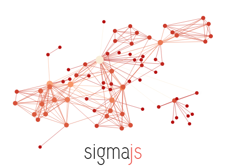

<!-- PROJECT LOGO -->
<br />
<div align="center">
  <a href="https://github.com/othneildrew/Best-README-Template">
    
  </a>

  <h1 align="center" style="margin-top: 20px;">Network Graph with React Sigma</h1>

  <div>This is not the official React Sigma repository and only provides some helpful templates.</div>

  <a href="https://sim51.github.io/react-sigma/"><strong>Official Documentation</strong></a>

  <p align="center">
    This repository contains a basic template to get started with a new Network Graph made with React Sigma. Additionally, a library of features to improve your Graph will be added step by step.
    <br />     
  </p>

  <a href="https://github.com/Svenstar74/react-sigma-template/issues">Report Bug</a>
  ·
  <a href="https://github.com/Svenstar74/react-sigma-template/issues">Request Feature</a>

</div>

<br />

<!-- Prerequisites -->
## Prerequisites
To use this template, you should have a basic understanding of the following subjects.
<ul>
   <li>HTML / CSS / TypeScript</li>
   <li>Node.js</li>
   <li>React</li>
</ul>

<!-- Get Started -->
## Getting Started
1. Clone / Fork this repository
2. Go to that folder and run `npm install` in the terminal
3. Run `npm start` and open the website you can see in the terminal

<!-- How it Works -->
## How it Works
### Base Template
This project was created with `npm create vite@latest` and uses React + Typescript. React Sigma was setup as defined in their [*Getting Started* guide](https://sim51.github.io/react-sigma/docs/start-installation).

Then, the two basic files below were added to show a simple graph with one node, preparing the project to add features to it.
<details>
   <summary>DisplayGraph.tsx</summary>

```TypeScript
import '@react-sigma/core/lib/react-sigma.min.css';
import { SigmaContainer } from '@react-sigma/core';

import LoadGraph from './LoadGraph';

function DisplayGraph() {
  return (
    <SigmaContainer
      style={{ width: '100vw', height: '100vh' }}
    >
      <LoadGraph />
    </SigmaContainer>
  );
}

export default DisplayGraph;

```
   
</details>

<details>
   <summary>LoadGraph.tsx</summary>

```TypeScript
import { useEffect } from "react";
import { useLoadGraph } from "@react-sigma/core";
import Graph from "graphology";

function LoadGraph() {
  const loadGraph = useLoadGraph();

  useEffect(() => {
    const graph = new Graph();
    graph.addNode("first", { x: 0, y: 0, size: 15, label: "My first node", color: "#FA4F40" });

    loadGraph(graph);
  }, [loadGraph]);

  return null;
};

export default LoadGraph;

```
   
</details>

### Feature Templates

Besides the *main* branch, there are several feature branches available to expand the base template. A feature consists of a folder and is implemented in the *DisplayGraph* component.

As an example, the *feature/prevent-double-click-stage* branch has a folder *src/Graph/Features/PreventDoubleClickStage*. If you add this folder to your project (customize it if necessary) and add the component to the *DisplayGraph.tsx* file like below, you're all setup to use the feature.
```TypeScript
import '@react-sigma/core/lib/react-sigma.min.css';
import { SigmaContainer } from '@react-sigma/core';

import LoadGraph from './LoadGraph';

{/* Import the feature */}
import PreventDoubleClickStage from './Features/PreventDoubleClickStage/GraphEvents';

function DisplayGraph() {
  return (
    <SigmaContainer
      style={{ width: '100vw', height: '100vh' }}
    >
      <LoadGraph />

      {/* Add the feature in the SigmaContainer */}
      <PreventDoubleClickStage />
    </SigmaContainer>
  );
}

export default DisplayGraph;

```

### List of Features
**Basic:** These are some trivial features that I like to use in many of my projects.

<details>
  <summary><b>Prevent Double Click Stage</b></summary>
  
  **Branch:** `feature/prevent-double-click-stage`  
  **Description:** By default, the Sigma Graph zooms in when you double click on the stage. This feature prevents that, because sometimes I find it annoying.
</details>

